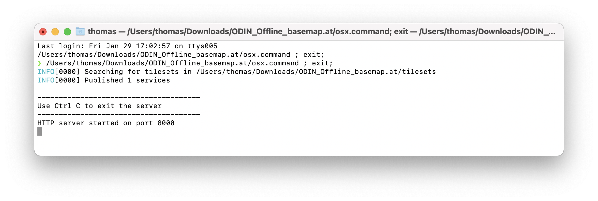
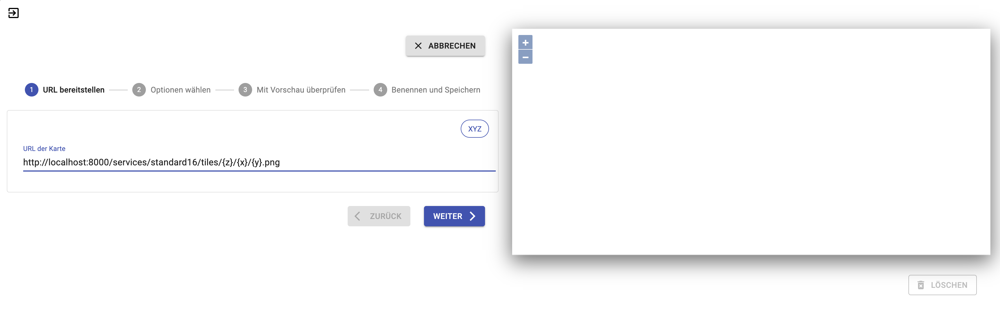
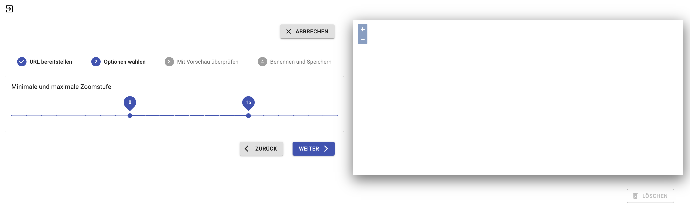
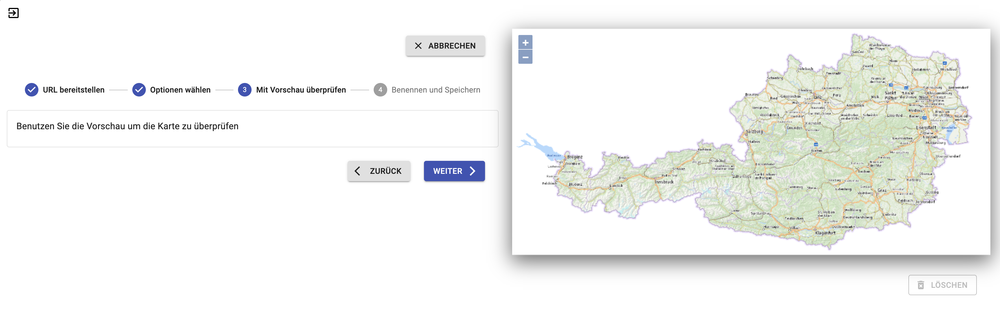
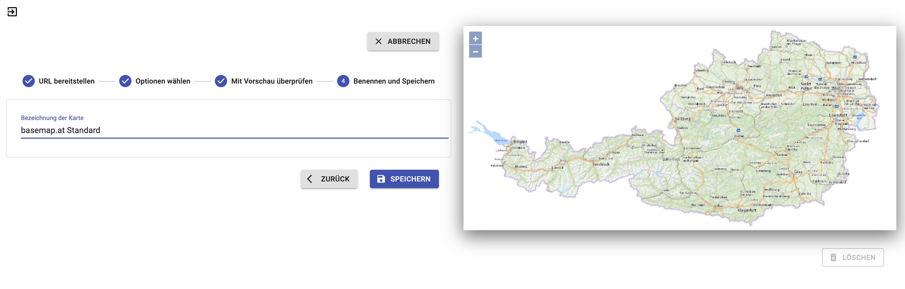

# Motivation

Für unser Open-Source Führungsinformationssystem ODIN soll Kartenmaterial auch offline zur Verfügung stehen. Diese Anforderung erscheint nur logisch wenn man bedenkt, dass sowohl zivile wie auch militärische Einsatzkräfte in hohem Ausmaß unabhängig von vorhandener bzw. funktionierender Infrastruktur operieren müssen. Offline Fähigkeit bedeutet in diesem Zusammenhang, dass der Einsatz ohne eine Verbindung zum Internet durchgeführt werden kann.

# Methode

Unser Ansatz ist grundsätzlich "user first". D.h., die Anwendung so zu gestalten, dass selbst ungeübte Personen rasch Erfolge erzielen und die Bedienung der Anwendung dem eigentlichen Ziel nicht "im Weg" ist.

Das soll auch bei diesem Tutorial im Vordergrund stahen, wiewohl die gewählte Methode für das Bereistellen des Kartenmaterials zwar einfach ist, aber gerade für nicht versierte Benutzer auf den ersten Blick abschreckend erscheint.

# Kartenmaterial
Unser FüIS ODIN kann Kartenmaterial einbinden, das typischerweise von einem Kartenprovider bereitgestellt wird. Typische Vertreter von öffentlich zugänglichen Kartenprovidern sind z.B. OpenStreetMap oder basemap.at. Letztere werden wir beispielhaft in diesem Tutorial nutzen, da die notwendigen Daten von basemap.at bereits für den Download bereitgestellt werden.

Das Kartenmaterial wird in der Form von quadratischen Kacheln (Tiles) bereitgestellt, d.h. das sichtbare Kartenbild setzt sich aus einer Anzahl von Kacheln zusammen. Die Auswahl der Kacheln hängt von der Zoom-Stufe und vom Kartenausschnitt ab. Um nun die für den aktuell gewählten Kartenausschnitt notwendigen Kacheln zu laden, werden diese vom Kartenprovider angefordert. Die Addressierung der Kacheln erfolgt über das sogenannte x/y/z Schema, wobei die Variable {z}
 für die Zoomstufe und {x}{y} für die Koordinaten der Kachel in dieser Zoomstufe stehen. Werden die Karten über das Internet angeboten, dann konsumiert man die Kacheln beispielhaft über eine URL wie diese: https://{servername}/{kartenname}/{z}/{x}/{y}.png
 
Für die Nutzung von Kartenmaterial ohne Inernetzugang werden die Kacheln in einen Container gepackt. Das ermöglicht die Verteilung und Nutzung durch die Bereitstellung einer einzigen - zugegeben sehr großen - Datei.
 
## Container
Für dieses Tutorial verwenden wir die Offline Container von basemap.at. Die maximale Zoomstufe 16 entspricht etwa einem Maßstab von 1:8000 (siehe [OpenStreetMap Zoom Levels](https://wiki.openstreetmap.org/wiki/Zoom_levels)

* [basemap.at Standard Auflösung, Zoom 0..16 (19 GB!)](https://www.basemap.at/downloads/offline/bmap_standard_mbtiles_L00bisL16.zip)
und/oder
* [basemap.at Orthofoto, Zoom 0..16 (9 GB!)](https://www.basemap.at/downloads/offline/bmap_orthofoto_mbtiles_L00bisL16.zip)
 
 
## Offline Bereitstellung
Wie schon im Punkt Kartenmaterial beschrieben, wird das Kartenmaterial typischerweise über einen Server bereitgestellt und die Kartenkacheln über eine URL geladen. Das werden wir auch in diesem Tutorial so machen. Wir stellen einen minimalen Karten-Server zur Verfügung, der vom [US Conservation Biology Institute
](https://github.com/consbio/mbtileserver) als frei verwendbare Open-Source Software bereitgestellt wird.

Dazu benötigen wir [den ODIN Offline Maps MBTiles Server](https://github.com/syncpoint/offline-mbtiles/releases/download/v1.0/ODIN_Offline_Maps.zip) und entpacken das Archiv (ZIP) an einen beliebigen Ort im Dateisystem. Das Resultat sieht so aus:

```
├── mbtileserver
├── mbtileserver.exe
├── osx.command
├── tilesets
     ├── drop-MBTile-files-here.txt
├── windows.cmd
```

Nun laden wir einen (oder beide) der oben angeführten Container von basemap.at und entpacken die darin enthaltene(n) ```.mbtiles``` Dateien in den Ordner ```tilesets```. Wir haben das hier mit dem "Standard" Tile Container gemacht. Möglicherweise kann der Name des Containers von dem in diesem Beispiel abweichen, jedoch sollte darauf geachtet werden, dass der Dateiname __keine__ Leer- oder Sonderzeichen enthält:

```
├── mbtileserver
├── mbtileserver.exe
├── osx.command
├── tilesets
     ├── drop-MBTile-files-here.txt
     ├── standard16.mbtiles
├── windows.cmd
```

## Starten des Servers
Wir stellen in diesem Tutorial ausführbare Dateien für _MacOS-X_ und _Windows_ zur Verfügung. Bitte je nach Betriebssystem entweder ```osx.command``` oder ```windows.cmd``` im Finder/Datei Explorer doppelklicken. Dadurch wird der _Tile Server_ gestartet und es öffnet sich ein Fenster:



Ser lokale Tile Server ist nun bereit und stellt (in diesem Fall) ein _Tileset_ (also ein spezifisches Kartenmaterial) unter der URL ```http://localhost:8000/services``` zur Verfügung. Um herauszufinden, wie genau wir an das Kartenmaterial herankommen, öffnen wir diese URL in einem beliebigen Browser. Der Server gibt nun Aukunft darüber, welches Kartenmaterial abgerufen werden kann:

```json
[{"imageType":"png","url":"http://localhost:8000/services/standard16","name":"GDE-basemap_Standard1"}]
```

Ok, wir müssen also noch weiter navigieren und öffnen die angegebene URL ```http://localhost:8000/services/standard16``` (nun lässt sich auch erkennen, warum der oben verwendete Dateiname keine Leer- oder Sonderzeichen enthalten soll: dieser Name wird als URL bereitgestellt):
 
```json
{
  "bounds":[9.3,46.1,17.9,49.5],
  "description":"Created with  www.GPSDatenErfassung.at",
  "format":"png",
  "map":"http://localhost:8000/services/standard16/map",
  "maxZoom":"16",
  "maxzoom":16,
  "minZoom":"8",
  "minzoom":8,
  "name":"GDE-basemap_Standard1",
  "scheme":"xyz",
  "tilejson":"2.1.0",
  "tiles":["http://localhost:8000/services/standard16/tiles/{z}/{x}/{y}.png"],
  "type":"baselayer",
  "version":"1.1"
 }
```
 
Die für uns wichtige Information versteckt sich hinter der Eigenschaft ```tiles```. Die URL ```http://localhost:8000/services/standard16/tiles/{z}/{x}/{y}.png``` entspricht dem oben erklärten z/x/y Schema und wird jetzt in ODIN verwendet.

Um bei vielen ```mbtiles``` Containern sicherzustellen, dass wir auch den richtigen erwischt haben, lässt sich über die in der Eigenschaft ```map``` angegebenen URL ```http://localhost:8000/services/standard16/map``` eine lokale Vorschau im Browser starten.
 
# Nutzung in ODIN (oder anderer Software)
Die oben ermittelte URL für den lokalen Tile Provider ```http://localhost:8000/services/standard16/tiles/{z}/{x}/{y}.png``` werden wir nun in ODIN verwenden. Dazu öffnen wir die Verwaltung der Basiskarten und fügen mit Hilfe des Assistenten einen neuen Eintrag hinzu. Die verwendete URL bzw. die Werte für ```minZoom``` (8) und ```maxZoom``` (16) stammen aus den ermittelten Daten der basemap.at:






Geschafft! So lange der lokale Tile Server läuft, können wir nun mit ODIN - und antürlich mit jeder anderer Software, die Tiles nach dem x/y/z Schema laden kann - die Karten offline verwenden. Da die Nutzung des Tile Servers nicht auf die lokale Maschine beschränkt ist, kann man sie z.B. in einem LAN einsetzen und so eine Reihe von Clients mit nur einem Server bedienen.

# Ausblick
Im Augenblick ist die offline Nutzung von Karten zwar funktional einwandfrei aber noch ein wenig hakelig. In einer der nächsten Versionen von ODIN werden wir die Erkennung der offline verfügbaren Karten automatisieren und in den Assistenten zur Nutzung der Basiskarten integrieren.
